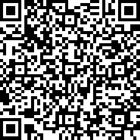

### 动手实践，第一现场活动，我们马上开始！
Kubernetes、.Net Core、docker、微服务、CI/CD这几个关键字，大家应该天天都可以碰到，这些技术点也是我们现在“复合工作”不可缺少的一部分，帮助我们提高了软件开发速度与质量，也改善了我们在后期软件系统运维的难道，更是使我们在软件系统扩展、各系统之间的依赖等复杂的事情变得简单起来。也许你都可以在某个技术点熟悉的独立使用，但是如果这些技术都在Kubernetes跑起来，你有想知道是一件什么疯狂的事情么？  
2019/11/10我们在上海.NET Conf大会第二天，由**张善友**、**陈计节**、**刘腾飞**三位重量级老师合台，会给大家带来一堂实实在在的“干货”：.Net Core 基于K8S的微服务和CI/CD，整个课程中会有三位助教（*陈作*、*张潇*、*章展宏*）帮你完成。  

#### 大家可以通过什么样的方式来参与：
+ 来到我们现场
    + 报名联系微信：  
    
+ 通过网络直播平台参与  
    + 直播地址：  
    

#### 整个“动手实践”课程中你可以亲手掌握并运用以下内容：
##### 1. K8S基础
+ Pod  
+ Service  
+ Ingress  
+ Deployment
+ Dashboard 

##### 2. 微服务相关
+ 服务通信
+ 网关
+ 统一认证&授权
+ 配置

##### 3. 集成测试与CI/CD
+ 基本原理
+ .Net Core CI/CD 流程
+ Jenkins工具的使用
+ 云原生环节的CI/CD

#### 无论你使用何种方式参与我们的“动手实践”活动，那么以下内容提前准备，会使你在整个过程中得到事办功倍的效果；


##### 软硬件环境依赖

* 可用内存：8GB 或更多
* 操作系统：Windows/macOS
* 浏览器：Chrome/Edge/Safari
* .NET Core 开发环境
  * 集成开发 IDE，任选其一即可：
    * Visual Studio 2017 或更新
    * Visual Studio Code
    * JetBrains Rider 2018.3 或更新
  * [.NET Core SDK](https://dotnet.microsoft.com/download/dotnet-core/2.2)，请使用 2.2 版本
* [Git](http://git-scm.com) 1.9 或更新
* 容器开发环境
  * [Docker](https://docs.docker.com/install/) 18.09 或更新
  * [kubectl](https://kubernetes.io/docs/tasks/tools/install-kubectl/) 1.14.7（对于不在现场参与的人士，请使用与你的集群相匹配的版本）
* 命令行环境
  * Git Bash/WSL
  * macOS Terminal/iTerm

## 验证你的环境

执行以下命令以确保你电脑上的各个软件均运行正确：

```sh
dotnet --version
git --version
docker --version
kubectl version --client
```

## 工作坊前的准备工作

在现场参与工作坊的人士，下列准备工作将在现场按照讲师的引导完成。

### 不在现场的参与者

在现场参与工作坊的人士，请忽此节。此部分基础设施，将由工作坊组织方提供。对于不在现场的参与者，要么使用 [Azure Kubernetes Service 服务](https://www.azure.cn/home/features/kubernetes-service) (aks) 或其他云服务创建你自己的集群，要么请使用 [Minikube](https://minikube.sigs.k8s.io/) 创建一个自有集群。创建集群时，请确保集群的工作节点上至少有 8GB 的可用内存。

如果你使用 aks 集群，请[参考此处](https://github.com/netconf-cn2019-workshop/dev-services/blob/master/azure/README.md)的文档完成对集群的必要初始化工具。如果使用自建的集群，请根据其对应的文档添加 Ingress Controller 等扩展功能。

集群创建完成之后，请设置好你的本地工作环境的 kubectl，使用以下命令确保其能够成功连接到创建完成的集群：

```sh
kubectl cluster-info
```

### 现场参与的人士

不在现场参与工作坊的人士，请忽此节。现场参与人士访问集群的凭据，将由工作坊讲师在现场提供。

请将讲师提供的凭据文件置于 `~/.kube/config` 的位置：

请执行此命令完成用户凭据的放置：

```sh
mkdir -p ~/.kube
~/Downloads/kubeconfg ~/.kube/config
```

对于 Windows 用户，请使用 Git Bash 命令行工具执行上述命令。

注意，这一操作将覆盖你本地电脑上原有可能已经安装的 kubectl 凭据文件。如果有必要，请提前备份你原来位于 `~/.kube/config` 处的凭据文件。

然后测试你对工作坊环境的访问：

```sh
kubectl cluster-info
```

## 开始工作坊

### 部署 CI/CD 环境

请回到工作目录根目录，下载用于部署工作坊环境的脚本文件：

```sh
# cd <workspace>
git clone https://github.com/netconf-cn2019-workshop/dev-services.git
```

请根据 [CI/CD 部署文档](https://github.com/netconf-cn2019-workshop/dev-services/blob/master/CICD-DEPLOYMENT.md)，完成 CI/CD 环境的部署。

部署完成后，可以访问其中的 Jenkins 服务和 gogs 服务，以确定各个网站运行正常。


### 下载所有项目的源代码

CI/CD 环境部署完成之后，请回到工作目录根目录，使用如下脚本下载工作坊所需的所有项目代码：

```sh
# cd <workspace>
for p in "ECommerce.Catalog.Api" "ECommerce.Payment.Host" "ECommerce.Shipping.Host" "ECommerce.Common" "ECommerce.Reporting.Api" "ECommerce.WebApp" "ECommerce.Customers.Api" "ECommerce.Sales.Api" "ECommerce.Services.Common" ;  do git clone http://gogs-$(cat ./cicd-infra/vars | grep deploy_suffix | cut -d '=' -f 2).$(cat ./cicd-infra/vars | grep dns_suffix | cut -d '=' -f 2)/gogs/$_p.git; done
```

  

至此你已经完成了参加工作坊的所有准备工作。