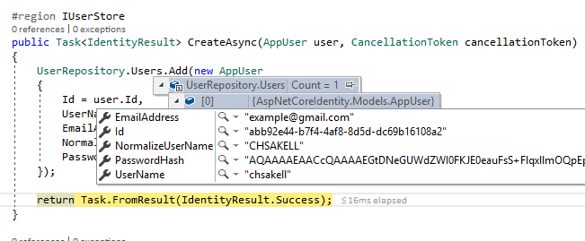
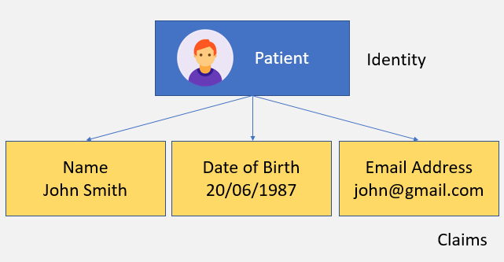

### ASP.NET Core Identity Series – Getting Started 
ASP.NET Core Identity is Microsoft’s membership system widely known to .NET developers for managing application users. And by managing we mean everything that has to do with a user account such as creating one, login functionality (cookies, tokens, Multi-Factor Authentication, etc..), resetting passwords, using external login providers or even providing access to certain resources. This membership system has always been quite easy to be used and plugged in a .NET application providing easy access to extremely useful helper methods around authentication that would be a pain in the ass to implement ourselves. Moreover, developers have highly associated it with Entity Framework and a specific SQL Schema used to support all the membership functionality. On the other hand, because of the fact that the library is so easy to be used without having any expertise on Identity and Security, developers many times find it difficult to extend it or customize its default behavior and fit their application needs. This can only be done only if there is deep knowledge on how the library works behind the scenes on its **kernel** and this is what we are gonna see on this post.

More specifically we will study the ASP.NET Core Identity library’s core components and the way they are architected and coupled together to provide the basic **user management** features. Through the ASP.NET Core Identity blog post series, we will be building step by step an ASP.NET Core Web application and explaining Identity features as we add them. Before start building the application though we need to learn the basics in theory.   
>The source code for the series is available [here](https://github.com/chsakell/aspnet-core-identity/). Each part will have a related branch on the repository. You can either follow along with the tutorial or simply clone the repository. In case you choose the latter make sure you checkout the **getting-started** branch as follow: 
```sh
git clone https://github.com/chsakell/aspnet-core-identity
cd .\aspnet-core-identity
git fetch
git checkout getting-started
```

This post is the first part of the **ASP.NET Core Identity Series**:
 - [x] Part 1: [Getting Started](https://chsakell.com/2018/04/28/asp-net-core-identity-series-getting-started/)  
- [ ] Part 2: [Integrate Entity Framework](https://chsakell.com/2018/05/11/asp-net-core-identity-series-integrating-entity-framework/)  
- [ ] Part 3: [Deep Dive in authorization](https://chsakell.com/2018/06/13/asp-net-core-identity-series-deep-dive-in-authorization/)  
- [ ] Part 4: [OAuth 2.0, OpenID Connect & IdentityServer](https://chsakell.com/2019/03/11/asp-net-core-identity-series-oauth-2-0-openid-connect-identityserver/)  
- [ ] Part 5: [External Provider authentication & registration strategy](https://chsakell.com/2019/07/28/asp-net-core-identity-series-external-provider-authentication-registration-strategy/)  
- [ ] Part 6: [Two-Factor Authentication](https://chsakell.com/2019/08/18/asp-net-core-identity-series-two-factor-authentication/)  

#### ASP.NET Core Identity Basics
It is fact that many developers confuse ASP.NET Core Identity’s role in the stack by thinking that it’s an authentication library. Well.. actually it isn’t but where does this assumption come from anyway? The answer is hidden in the library’s structure so let’s start investigating it from bottom to top. At the very bottom of the architecture there is a store which most of the times is a database.  
  
This is where the actual user data are stored, data such as usernames, email addresses or hashed passwords. The next layer is the **data access** layer which is implementations of the <font color=#069>IUserStore</font> and  <font color=#069>IRoleStore</font>interfaces.  

These interfaces abstract the way the membership schema is implemented in the database (or other type of storage) which means that this is where you may write your own data access layer that saves and managing users on your own store and custom schema. <font color=#069>IUserStore</font> is a required dependency for the next layer to work which means that you always have to provide an implentation for the library to work. In case you wonder, Entity Framework provides an IUserStore implementation out of the box which models a user as an IdentityUser in the database. The next layer is the one you probably use the most, the business layer and is aparted from the **UserManager** and **RoleManager**.  
  
These managers hold all the business logic such as validating user passwords based on configuration or checking that a user with the same username doesn’t exist in the database during registration. Under the hood managers make calls to the data access layer. The final layer is a set of extensions which I use to call **plugins**. The most used ***plugin*** is the **SignInManager** which manages sign in operations for users.  
  
These extensions sit on top of the managers by abstracting their logic or adding integration with other libraries. Signing a user using an external login is a simple example of these extensions. ASP.NET Core Identity’s role isn’t authenticating users but managing them. But what extensions can do is take this step further and add functionality such as authenticating users. So looking back to the question why do many developers think of ASP.NET Core Identity as an authentication library? Because of it’s widely known and commonly used extensions that provide this type of functionality! Enough with the theory, let’s get start coding and explaining each feature step by step.  
### Start coding  
Open Visual Studio 2017 and create a .NET Core 2.0 Web Application named AspNetCoreIdentity by selecting the Angular template. The first thing you need to do is change the installed dependencies. By default the selected template will reference the <font color=#069>Microsoft.AspNetCore.All</font> package which includes a bunch of unnecessary packages. Right click the project and select edit ***AspNetCoreIdentity.scproj***. Remove the default <font color=#069>Microsoft.AspNetCore.All</font> reference and add the following:  
```c#
<ItemGroup>
<PackageReference Include="Microsoft.AspNetCore" Version="2.0.2" />
<PackageReference Include="Microsoft.AspNetCore.Mvc" Version="2.0.3" />
<PackageReference Include="Microsoft.AspNetCore.SpaServices" Version="2.0.3" />
<PackageReference Include="Microsoft.AspNetCore.StaticFiles" Version="2.0.2" />
</ItemGroup>
```  
Switch to <font color=#069>Startup.cs</font> file and register ASP.NET Core Identity inside the ConfigureServices method as follow:  
```c#
public void ConfigureServices(IServiceCollection services)
{
    services.AddIdentityCore<AppUser>(options => { });
 
    services.AddMvc();
}
```  
First let’s fix the compalition errors and then we will explain what’s happening behind the scenes. Install the <font color=#069>Microsoft.Extensions.Identity.Core</font> NuGet package using the NuGet package manager or simply run the following command on the Package Manager Console.  
```sh
install-package Microsoft.Extensions.Identity.Core
```  
Next create a Models folder and add the <font color=#069>AppUser</font> class.  
```c#
public class AppUser
{
    public string Id { get; set; }
    public string UserName { get; set; }
    public string Email { get; set; }
    public string NormalizeUserName { get; set; }
    public string PasswordHash { get; set; }
}
```  
The <font color=#069>Microsoft.Extensions.Identity.Core</font> package contains the core interfaces and managers to get started with ASP.NET Core Identity and also provides default implementations for features such as password hashing. The <font color=#069>AddIdentityCore\<T\></font> generic method will register and make all required dependencies for a <font color=#069>UserManager\<T\></font> and a <font color=#069>RoleManager\<T\></font> available as well. But what exactly is a <font color=#069>UserManager\<T\></font> anyway? UserManager as already mentioned belongs to the business layer of the ASP.NET Core Identity’s architecture and provides the APIs for managing users in the persistence store. Operations such as resetting password, email configuration or password validation are made through this entity. To accomplish all these the manager requires a set of dependencies which we can study on its constructor.  
#### UserManager constructor:
```c#
public UserManager(IUserStore<TUser> store,
    IOptions<IdentityOptions> optionsAccessor,
    IPasswordHasher<TUser> passwordHasher,
    IEnumerable<IUserValidator<TUser>> userValidators,
    IEnumerable<IPasswordValidator<TUser>> passwordValidators,
    ILookupNormalizer keyNormalizer,
    IdentityErrorDescriber errors,
    IServiceProvider services,
    ILogger<UserManager<TUser>> logger)
```  
Following is a list describing each of the constructor’s dependencies: 
- **<font color=#069>IUserStore\<TUser\></font>** store: The persistence store the manager will operate over  
- **<font color=#069>IOptions\<IdentityOptions\></font>** optionsAccessor: The accessor used to access the <font color=#069>IdentityOptions</font>  
- **<font color=#069>IPasswordHasher\<TUser\></font>** passwordHasher: The password hashing implementation to use when saving passwords  
- **<font color=#069>IEnumerable\<IUserValidator\<TUser\>\></font>** userValidators: A collection of <font color=#069>IUserValidator\<TUser\></font> to validate users against  
- **<font color=#069>IEnumerable\<IPasswordValidator\<TUser\>\></font>** passwordValidators: A collection of <font color=#069>IPasswordValidator\<TUser\></font> to validate passwords against  
- **<font color=#069>ILookupNormalizer keyNormalizer</font>**: The <font color=#069>ILookupNormalizer</font> to use when generating index keys for users  
- **<font color=#069>IdentityErrorDescriber errors</font>**: The <font color=#069>IdentityErrorDescriber</font> used to provide error messages  
- **<font color=#069>IServiceProvider services</font>**: The <font color=#069>IServiceProvider</font> used to resolve services  
- **<font color=#069>ILogger\<UserManager\<TUser\>\> logger</font>**: The logger used to log messages, warnings and errors  
The <font color=#069>AddIdentityCore\<T\></font> method will add and configure the identity system for the specified User and Role types.  

```c#
public static IdentityBuilder AddIdentityCore<TUser>(this IServiceCollection services, Action<IdentityOptions> setupAction)
    where TUser : class
{
    // Services identity depends on
    services.AddOptions().AddLogging();
 
    // Services used by identity
    services.TryAddScoped<IUserValidator<TUser>, UserValidator<TUser>>();
    services.TryAddScoped<IPasswordValidator<TUser>, PasswordValidator<TUser>>();
    services.TryAddScoped<IPasswordHasher<TUser>, PasswordHasher<TUser>>();
    services.TryAddScoped<ILookupNormalizer, UpperInvariantLookupNormalizer>();
    // No interface for the error describer so we can add errors without rev'ing the interface
    services.TryAddScoped<IdentityErrorDescriber>();
    services.TryAddScoped<IUserClaimsPrincipalFactory<TUser>, UserClaimsPrincipalFactory<TUser>>();
    services.TryAddScoped<UserManager<TUser>, UserManager<TUser>>();
 
    if (setupAction != null)
    {
        services.Configure(setupAction);
    }
 
    return new IdentityBuilder(typeof(TUser), services);
}
```  
Having said all that let’s switch back to our solution and try to register a user. Before doing so we will add some helper **ViewModel** classes to be used in our <font color=#069>AccountController</font>. Add a new folder named **ViewModels** and create the following two classes.  
RegisterVM.cs
```c#
public class RegisterVM
{
    public string UserName { get; set; }
 
    [DataType(DataType.EmailAddress)]
    public string Email { get; set; }
 
    [DataType(DataType.Password)]
    public string Password { get; set; }
 
    [Compare("Password")]
    [DataType(DataType.Password)]
    public string ConfirmPassword { get; set; }
}
```  
ResultVM.cs
```c#
public class ResultVM
{
    public Status Status { get; set; }
    public string Message { get; set; }
    public object Data { get; set; }
}
 ````
 ```c#
public enum Status
{
    Success = 1,
    Error = 2
}
```  
Next create the <font color=#069>AccountController</font> Controller inside the Controllers folder and paste the following code. 
```c#
[Route("api/[controller]/[action]")]
public class AccountController : Controller
{
    private readonly UserManager<AppUser> _userManager;
 
    public AccountController(UserManager<AppUser> userManager)
    {
        this._userManager = userManager;
    }
 
    [HttpPost]
    public async Task<ResultVM> Register([FromBody]RegisterVM model)
    {
        if (ModelState.IsValid)
        {
            IdentityResult result = null;
            var user = await _userManager.FindByNameAsync(model.UserName);
 
            if (user != null)
            {
                return new ResultVM
                {
                    Status = Status.Error,
                    Message = "Invalid data",
                    Data = "<li>User already exists</li>"
                };
            }
 
            user = new AppUser
            {
                Id = Guid.NewGuid().ToString(),
                UserName = model.UserName,
                Email = model.Email
            };
 
            result = await _userManager.CreateAsync(user, model.Password);
 
            if (result.Succeeded)
            {
                return new ResultVM
                {
                    Status = Status.Success,
                    Message = "User Created",
                    Data = user
                };
            }
            else
            {
                var resultErrors = result.Errors.Select(e => "<li>" + e.Description + "</li>");
                return new ResultVM
                {
                    Status = Status.Error,
                    Message = "Invalid data",
                    Data = string.Join("", resultErrors)
                };
            }
        }
 
        var errors = ModelState.Keys.Select(e => "<li>" + e + "</li>");
        return new ResultVM
        {
            Status = Status.Error,
            Message = "Invalid data",
            Data = string.Join("", errors)
        };
    }
}
```  
Don’t mind that much about the returned results (will be used from the front later on..), just focus on the highlighted lines where either we try to find a user or we register one. Fire up the app and try to register a user by sending the following POST request to the AccountController register method using Fiddler or Postman (make sure you set Content-Type: application/json).
POST request to /api/account/register 
```c#
{
    "userName" : "chsakell",
    "email" : "example@gmail.com",
    "password" : "&MysuperPass123",
    "confirmPassword" : "&MysuperPass123"
}
```  
As soon as you try to send the request you will get an awesome error saying:
>InvalidOperationException: Unable to resolve service for type ‘Microsoft.AspNetCore.Identity.IUserStore`1[AspNetCoreIdentity.Models.AppUser]’ while attempting to activate ‘Microsoft.AspNetCore.Identity.UserManager`1[AspNetCoreIdentity.Models.AppUser]’  
>
  
Well this is quite descriptive isn’t it? It says that we haven’t provided an <font color=#069>IUserStore\<AppUser\></font> and hence the <font color=#069>UserManager\<AppUser\></font> couln’t get activated. Of course this makes sense since we haven’t decided yet the store (lowest level in architecture) where the user and role entities are actually stored. Also if you recall, the very first parameter of the <font color=#069>UserManager\<T\></font> constructor is of type <font color=#069>IUserStore\<TUser\></font> store. So let’s provide an implementation of <font color=#069>IUserStore\<TUser\></font> store. For this part of the series we will be using an in memory repository just to simplify and focus on the core components of the ASP.NET Core Identity library. Add the **UserRepository** class inside a new folder named Infrastructure.  
InfrastructureUserRepository.cs  
```c#
public static class UserRepository
{
    public static List<AppUser> Users;
 
    static UserRepository()
    {
        Users = new List<AppUser>();
    }
}
```  
Inside the same folder add a class named <font color=#069>AppUserStore</font> and implement the <font color=#069>IUserStore\<AppUser\></font> interface. The <font color=#069>IUserStore\<TUser\></font> interface requires that T is a class which means that nothing restricts you to implement the backing store however you wish. This answers the question you may have had for a long time, how to use ASP.NET Core Identity with your own custom schema and not by extending the Entity’s Framework IdentityUser model. Let’s take a look at the <font color=#069>IUserStore\<TUser\></font> interface methods before viewing the <font color=#069>AppUserStore</font> code.  
#### IUserStore 
```csharp
public interface IUserStore<TUser> : IDisposable where TUser : class
{
    /// <summary>
    /// Gets the user identifier for the specified user/>.
    /// </summary>
    Task<string> GetUserIdAsync(TUser user, CancellationToken cancellationToken);
 
    /// <summary>
    /// Gets the user name for the specified user/>.
    /// </summary>
    Task<string> GetUserNameAsync(TUser user, CancellationToken cancellationToken);
 
    /// <summary>
    /// Sets the given <paramref name="userName" /> for the specified user/>.
    /// </summary>
    Task SetUserNameAsync(TUser user, string userName, CancellationToken cancellationToken);
 
    /// <summary>
    /// Gets the normalized user name for the specified user/>.
    /// </summary>
    Task<string> GetNormalizedUserNameAsync(TUser user, CancellationToken cancellationToken);
 
    /// <summary>
    /// Sets the given normalized name for the specified user/>.
    /// </summary>
    Task SetNormalizedUserNameAsync(TUser user, string normalizedName, CancellationToken cancellationToken);
 
    /// <summary>
    /// Creates the specified user/> in the user store.
    /// </summary>
    Task<IdentityResult> CreateAsync(TUser user, CancellationToken cancellationToken);
 
    /// <summary>
    /// Updates the specified user/> in the user store.
    /// </summary>
    Task<IdentityResult> UpdateAsync(TUser user, CancellationToken cancellationToken);
 
    /// <summary>
    /// Deletes the specified user/> from the user store.
    /// </summary>
    Task<IdentityResult> DeleteAsync(TUser user, CancellationToken cancellationToken);
 
    /// <summary>
    /// Finds and returns a user, if any, who has the specified userId/>.
    /// </summary>
    Task<TUser> FindByIdAsync(string userId, CancellationToken cancellationToken);
 
    /// <summary>
    /// Finds and returns a user, if any, who has the specified normalized user name.
    /// </summary>
    Task<TUser> FindByNameAsync(string normalizedUserName, CancellationToken cancellationToken);
}
```
The default implementation for the normalized name is the uppercase username. Appart from an <font color=#069>IUserStore</font> implementation you also have to provide an <font color=#069>IUserPasswordStore</font> implementation as well. This interface is much simpler and provides an abstraction for a store containing users password hashes.  
#### IUserPasswordStore  
```csharp
public interface IUserPasswordStore<TUser> : IUserStore<TUser> where TUser : class
{
    /// <summary>
    /// Sets the password hash for the specified user/>.
    /// </summary>
    Task SetPasswordHashAsync(TUser user, string passwordHash, CancellationToken cancellationToken);
 
    /// <summary>
    /// Gets the password hash for the specified user/>.
    /// </summary>
    Task<string> GetPasswordHashAsync(TUser user, CancellationToken cancellationToken);
 
    /// <summary>
    /// Gets a flag indicating whether the specified user/> has a password.
    /// </summary>
    Task<bool> HasPasswordAsync(TUser user, CancellationToken cancellationToken);
} 
```  
Following is the <font color=#069>AppUserStore</font> implementing both the <font color=#069>IUserStore\<AppUser\></font> and the <font color=#069>IUserPasswordStore\<AppUser\></font> while saving users in an in memory store.  
```csharp
public class AppUserStore : IUserStore<AppUser>, IUserPasswordStore<AppUser>
{
    #region IUserStore
    public Task<IdentityResult> CreateAsync(AppUser user, CancellationToken cancellationToken)
    {
        UserRepository.Users.Add(new AppUser
        {
            Id = user.Id,
            UserName = user.UserName,
            Email = user.Email,
            NormalizeUserName = user.NormalizeUserName,
            PasswordHash = user.PasswordHash
        });
 
        return Task.FromResult(IdentityResult.Success);
    }
 
    public Task<IdentityResult> DeleteAsync(AppUser user, CancellationToken cancellationToken)
    {
        var appUser = UserRepository.Users.FirstOrDefault(u => u.Id == user.Id);
 
        if (appUser != null)
        {
            UserRepository.Users.Remove(appUser);
        }
 
        return Task.FromResult(IdentityResult.Success);
    }
 
    public void Dispose()
    {
        // throw new NotImplementedException();
    }
 
    public Task<AppUser> FindByIdAsync(string userId, CancellationToken cancellationToken)
    {
        return Task.FromResult(UserRepository.Users.FirstOrDefault(u => u.Id == userId));
    }
 
    public Task<AppUser> FindByNameAsync(string normalizedUserName, CancellationToken cancellationToken)
    {
        return Task.FromResult(UserRepository.Users.FirstOrDefault(u => u.NormalizeUserName == normalizedUserName));
    }
 
    public Task<string> GetNormalizedUserNameAsync(AppUser user, CancellationToken cancellationToken)
    {
        return Task.FromResult(user.NormalizeUserName);
    }
 
    public Task<string> GetUserIdAsync(AppUser user, CancellationToken cancellationToken)
    {
        return Task.FromResult(user.Id);
    }
 
    public Task<string> GetUserNameAsync(AppUser user, CancellationToken cancellationToken)
    {
        return Task.FromResult(user.UserName);
    }
 
    public Task SetNormalizedUserNameAsync(AppUser user, string normalizedName, CancellationToken cancellationToken)
    {
        user.NormalizeUserName = normalizedName;
        return Task.CompletedTask;
    }
 
    public Task SetUserNameAsync(AppUser user, string userName, CancellationToken cancellationToken)
    {
        user.UserName = userName;
        return Task.CompletedTask;
    }
 
    public Task<IdentityResult> UpdateAsync(AppUser user, CancellationToken cancellationToken)
    {
        var appUser = UserRepository.Users.FirstOrDefault(u => u.Id == user.Id);
 
        if (appUser != null)
        {
            appUser.NormalizeUserName = user.NormalizeUserName;
            appUser.UserName = user.UserName;
            appUser.Email = user.Email;
            appUser.PasswordHash = user.PasswordHash;
        }
 
        return Task.FromResult(IdentityResult.Success);
    }
 
    #endregion
 
    #region IUserPasswordStore
    public Task<bool> HasPasswordAsync(AppUser user, CancellationToken cancellationToken)
    {
        return Task.FromResult(user.PasswordHash != null);
    }
 
    public Task<string> GetPasswordHashAsync(AppUser user, CancellationToken cancellationToken)
    {
        return Task.FromResult(user.PasswordHash);
    }
 
    public Task SetPasswordHashAsync(AppUser user, string passwordHash, CancellationToken cancellationToken)
    {
        user.PasswordHash = passwordHash;
        return Task.CompletedTask;
    }
 
    #endregion
}
```  
Now that we do have an <font color=#069>IUserStore</font> implementation switch back to <font color=#069>Startup</font> ConfigureServices method and add it to the services as follow:   
```csharp
public void ConfigureServices(IServiceCollection services)
{
    services.AddMvc();
 
    services.AddIdentityCore<AppUser>(options => { });
    services.AddScoped<IUserStore<AppUser>, AppUserStore>();
}
```  
Rebuild the app, fire up and POST the same request again. Verify that this time the user is being created successfully. Notice that when <font color=#069>_userManager.FindByNameAsync(model.UserName)</font> in the AccountController, invokes the <font color=#069>FindByNameAsync</font> of the AppUserStore provided. This makes sense if you study <font color=#069>UserManager</font>‘s implementation in the library. Here’s a part of it.  
#### UserManager FindByNameAsync
```csharp
public virtual async Task<TUser> FindByNameAsync(string userName)
{
    ThrowIfDisposed();
    if (userName == null)
    {
        throw new ArgumentNullException(nameof(userName));
    }
    userName = NormalizeKey(userName);
 
    var user = await Store.FindByNameAsync(userName, CancellationToken);
 
    // Code omitted
     
    return user;
}
```  
The same applies for the <font color=#069>_userManager.CreateAsync(user, model.Password)</font> call of the AccountController which internally invokes several methods both from <font color=#069>IUserPasswordStore</font> and the <font color=#069>IUserStore</font> which provided through the <font color=#069>AppUserStore</font>.
  
### Signing a user  
Now that we have a user registered and stored in the in memory collection we can procceed to the sign in feature. We will use **Cookie** authentication and for this we need to install a new package named <font color=#069>Microsoft.AspNetCore.Authentication.Cookies</font> which is the default ASP.NET Core authentication middleware. Install the package either from the NuGet Package manager or the Package Manager Console by running the following command:  
```sh
install-package Microsoft.AspNetCore.Authentication.Cookies
```  
>Notice that authentication isn’t handled by the ASP.NET Core Identity library but by the new authentication middleware we have just installed
>
In the <font color=#069>Starup</font> class first register the required services for the authentication middleware in the ConfigureServices method as follow:  
```csharp
public void ConfigureServices(IServiceCollection services)
{
    services.AddMvc();
 
    services.AddIdentityCore<AppUser>(options => { });
    services.AddScoped<IUserStore<AppUser>, AppUserStore>();
 
    services.AddAuthentication(CookieAuthenticationDefaults.AuthenticationScheme)
        .AddCookie(CookieAuthenticationDefaults.AuthenticationScheme, options =>
        {
            options.Events.OnRedirectToAccessDenied = ReplaceRedirector(HttpStatusCode.Forbidden, options.Events.OnRedirectToAccessDenied);
            options.Events.OnRedirectToLogin = ReplaceRedirector(HttpStatusCode.Unauthorized, options.Events.OnRedirectToLogin);
        });
}
``` 
The ***AddCookie*** method registers the services for a scheme named CookieAuthenticationDefaults.AuthenticationScheme which is “Cookies” and use it as the default with the <font color=#069>services.AddAuthentication</font> line. The options we passed to the method use a helper method that stops redirection to a login path if the requested route requires authentication and the request is Unauthorized. Paste the <font color=#069>ReplaceRedirector</font> method at the end of the Startup class.  

```csharp
// https://stackoverflow.com/questions/42030137/suppress-redirect-on-api-urls-in-asp-net-core/42030138#42030138
static Func<RedirectContext<CookieAuthenticationOptions>, Task> ReplaceRedirector(HttpStatusCode statusCode, 
    Func<RedirectContext<CookieAuthenticationOptions>, Task> existingRedirector) =>
    context =>
    {
        if (context.Request.Path.StartsWithSegments("/api"))
        {
            context.Response.StatusCode = (int)statusCode;
            return Task.CompletedTask;
        }
        return existingRedirector(context);
    };
```  
We need this feature on the Angular front because when a request is Unauthorized we don’t want MVC to redirect us to a new ***MVC*** route, for example /Account/login but only send back a 401 status code. We registered the required services for the authentication middleware but we didn’t add the middleware itself yet, so add it to the pipeline before the MVC middleware in the <font color=#069>Configure</font> method. 
#### part of Startup/Configure method
```csharp
app.UseStaticFiles();
 
app.UseAuthentication();
 
app.UseMvc(routes =>
// Code omitted
```  
For the AccountController Login method we need a new ViewModel class so go ahead and add the <font color=#069>LoginVM</font> to the ViewModels folder.  
```csharp
public class LoginVM
{
    public string UserName { get; set; }
 
    [DataType(DataType.Password)]
    public string Password { get; set; }
}
```  
Switch to the <font color=#069>AccountController</font> and create the Login method.  
```csharp
[HttpPost]
public async Task<ResultVM> Login([FromBody]LoginVM model)
{
    if (ModelState.IsValid)
    {
        var user = await _userManager.FindByNameAsync(model.UserName);
 
        if (user != null && await _userManager.CheckPasswordAsync(user, model.Password))
        {
            var identity = new ClaimsIdentity(CookieAuthenticationDefaults.AuthenticationScheme);
            identity.AddClaim(new Claim(ClaimTypes.NameIdentifier, user.Id));
            identity.AddClaim(new Claim(ClaimTypes.Name, user.UserName));
 
            await HttpContext.SignInAsync(CookieAuthenticationDefaults.AuthenticationScheme, new ClaimsPrincipal(identity));
 
            return new ResultVM
            {
                Status = Status.Success,
                Message = "Succesfull login",
                Data = model
            };
        }
 
        return new ResultVM
        {
            Status = Status.Error,
            Message = "Invalid data",
            Data = "<li>Invalid Username or Password</li>"
        };
    }
 
    var errors = ModelState.Keys.Select(e => "<li>" + e + "</li>");
    return new ResultVM
    {
        Status = Status.Error,
        Message = "Invalid data",
        Data = string.Join("", errors)
    };
}
```  
After checking that the user’s password is valid using UserManager password hasher, we use the <font color=#069>HttpContext.SignInAsync</font> method to create a <font color=#069>ClaimsPricipal</font> that represents a user in an HTTP Request. This principal accepts a <font color=#069>ClaimIdentity</font> authored by the default authentication scheme ***“Cookies”*** registered before and contains two claims. Before testing the Login method let’s take a quick look at how **Claim-based security** model works. 
### Claim-Based Authentication Model
Starting from bottom to top, a **Claim** is a property of an Identity consisted of a name-value pair specific to that Identity while an Identity may have many Claims associated with it. For example, a Patient which represents an Identity have multiple claims that define the patient.  
  
An Identity along with its claims is represented with the <font color=#069>ClaimsIdentity</font> class but that class isn’t the top of the hierarchy. This happens because a user may have multiple identities and that’s where <font color=#069>ClaimsPrincipal</font> fits into the model. A <font color=#069>ClaimsPrincipal</font> is consisted by 1 or more Claims Identities which in turn may have 1 or more Claims.  
  
The image above shows a user with a ClaimsPrincipal having two Claims Identities. One that defines the user as a Patient and has two claims and another one that defines the user through the driver license. Each of these Claims Identities may have different access level to different resources. Keep in mind that a ClaimsPrincipal inherits all the claims for each identity associated. The **Claim-based security** model utilizes ASP.NET Core Cookie middleware by encrypting, serializing and saving the ClaimsPrincipal in the cookie response after a succesfull sign in. During an HTTP request, the cookie is validated and the ClaimsPrincipal is assigned to the <font color=#069>HttpContext.User</font> property.  
Switch back to Postman and after registering a user try to login.  

  
### Front End  

On the front of our application there is an Angular app hitting the AccountController methods. We won’t paste all the code here since the source code is available [online](https://github.com/chsakell/aspnet-core-identity/tree/getting-started) but we will explain what’s actually happening. First of all, the app makes use of the following 3 new methods in AccountController  

>1.<font color=#069>Claims</font> method returns the Claims of an authenticated user and requires that the user is authenticated. In case the app tries to access this API without being authenticated it gets back a 401 Status code and redirects to an Angular login route. This is done through an angular interceptor  
2.<font color=#069>Authenticated</font> method checks if the user is authenticated  
3.<font color=#069>SignOut</font> method logs out an authenticated user  

Paste the following methods in the AccountController.  
```csharp
[HttpGet]
[Authorize]
public async Task<UserClaims> Claims()
{
    var claims = User.Claims.Select(c => new ClaimVM
    {
        Type = c.Type,
        Value = c.Value
    });
 
    return new UserClaims
    {
        UserName = User.Identity.Name,
        Claims = claims
    };
}
 
[HttpGet]
public async Task<UserStateVM> Authenticated()
{
    return new UserStateVM
    {
        IsAuthenticated = User.Identity.IsAuthenticated,
        Username = User.Identity.IsAuthenticated ? User.Identity.Name : string.Empty
    };
}
 
[HttpPost]
public async Task SignOut()
{
    await HttpContext.SignOutAsync(CookieAuthenticationDefaults.AuthenticationScheme);
}
```  
You also need the following ViewModels:  
ViewModelsClaimVM.cs  
```csharp
public class ClaimVM
{
    public string Type { get; set; }
    public string Value { get; set; }
}
 
public class UserClaims
{
    public IEnumerable<ClaimVM> Claims { get; set; }
    public string UserName { get; set; }
}
```  
ViewModelsUserStateVM.cs  
```charp
public class UserStateVM
{
    public bool IsAuthenticated { get; set; }
    public string Username { get; set; }
}
```
The basic components of the Angular app are displayed in following image:   

    

The register component simply registers the user by sending a POST request to the <font color=#069>api/account/register</font> method.  
 
 part of register.component.ts  
  
  ```csharp
  export class RegisterComponent {
    public user: RegisterVM = { userName: '', email: '', password: '', confirmPassword: '' };
    public errors: string = '';
 
    constructor(public http: Http, 
                @Inject('BASE_URL') public baseUrl: string,
                public router: Router) {
    }
 
    register() {
        this.errors = '';
        this.http.post(this.baseUrl + 'api/account/register', this.user).subscribe(result => {
            let registerResult = result.json() as ResultVM;
            if (registerResult.status === StatusEnum.Success) {
                this.router.navigate(['/login']);
            } else if (registerResult.status === StatusEnum.Error) {
                this.errors = registerResult.data.toString();
            }
 
        }, error => console.error(error));
    }
}
  ```  
 Notice that the api call may return validation errors to be displayed on the screen.  

    

If you try to view the Claims page without being authenticated you will be redirected in the Login view. This is done through an ***HTTP Interceptor*** which is implemented under the core folder of the client app.  
 
 ```csharp
@Injectable()
export class HttpInterceptor extends Http {

  constructor(backend: XHRBackend, defaultOptions: RequestOptions, 
    public stateService: StateService, public router: Router) {
    super(backend, defaultOptions);
  }

  request(url: string | Request, options?: RequestOptionsArgs): Observable<Response> {
    return super.request(url, options).catch((error: Response) => {
            if ((error.status === 401 || error.status === 403) && (window.location.href.match(/\?/g) || []).length < 2) {
                this.stateService.setAuthentication({ userName: '', isAuthenticated: false });
                this.router.navigate(['/login']);
            }
            return Observable.throw(error);
        });
  }
}
```  

The login compoment follows the same logic and after a succesfull login sets the state of the user to “isAuthenticated:true” using an angular service.  

```ts
@Injectable()
export class StateService {
    userState: UserState = { userName: '', isAuthenticated: false };

    constructor() { }

    /**
     * setAuthentication
     */
    public setAuthentication(state: UserState) {
        this.userState = state;
    }

    public isAuthenticated() {
        return this.userState.isAuthenticated;
    }
}

export interface UserState {
    userName: string;
    isAuthenticated: boolean;
}
```  
That’s it we have finished the first part of the <font color=#069>ASP.NET Core Identity Series</font> explainig how to get started with the library while focusing on its core components. Hopefully, you have understand the basic concepts of the library and how stores and managers are associated under the hood. Lots of interesting stuff comming on the next series such as integrating Entity Framework, external provider or token based authentication so make sure to stay tuned! 
>The repository for the Series is [here](https://github.com/chsakell/aspnet-core-identity) and each part will have a related branch