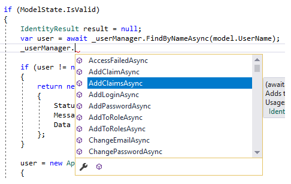

### ASP.NET Core Identity Series – Integrating Entity Framework 
<font color=#069>Microsoft.Extensions.Identity.Core</font> is the minimum ASP.NET Core Identity package you need to install in order to get start working with the core functionality of the library. We have seen how to do this in the [Getting Started](./asp-net-core-identity-series-getting-started.md) part of these ASP.NET Core Identity Series blog posts. As a quick reminder, what we did on the first part is implement and register a custom IUserStore along with a custom user entity to be used by the library’s managers. User entities were quite simple and saved at an in-memory store.  

```c#
// User Entity
public class AppUser
{
    public string Id { get; set; }
    public string UserName { get; set; }
    public string Email { get; set; }
    public string NormalizeUserName { get; set; }
    public string PasswordHash { get; set; }
}
 
// Implement a custom IUserStore
public class AppUserStore : IUserStore<AppUser>, IUserPasswordStore<AppUser></AppUser>
 
// register services at Startup
services.AddIdentityCore<AppUser>(options => { });
services.AddScoped<IUserStore<AppUser>, AppUserStore>();
```  
This configuration though is not sufficient (not even close) to leverage all ASP.NET Core Identity library’s features. To make this more clearer just switch to the <font color=#069>AccountController</font> and check the functions provided by a <font color=#069>UserManager</font> through the intellisense.  

  

As you can see you there are many things you can do using a <font color=#069>UserManager</font> such as adding claims or assigning roles to a user. But the custom user entity <font color=#069>AppUser</font> we created doesn’t have this type of properties and we didn’t provide any type of store that manages these properties either (obviously). For example, when <font color=#069>UserManager</font> tries to add a claim to a user, first it checks if there’s a registered implementation for <font color=#069>IUserClaimStore</font>.  

```c#
public virtual Task<IdentityResult> AddClaimAsync(TUser user, Claim claim)
{
    ThrowIfDisposed();
    var claimStore = GetClaimStore();
    if (claim == null)
    {
        throw new ArgumentNullException(nameof(claim));
    }
    if (user == null)
    {
        throw new ArgumentNullException(nameof(user));
    }
    return AddClaimsAsync(user, new Claim[] { claim });
}
 
private IUserClaimStore<TUser> GetClaimStore()
{
    var cast = Store as IUserClaimStore<TUser>;
    if (cast == null)
    {
        throw new NotSupportedException(Resources.StoreNotIUserClaimStore);
    }
    return cast;
}
```  

So what is the solution to our problem? The answer is hidden inside the <font color=#069>Microsoft.Extensions.Identity.Stores</font> NuGet package where you can find two important classes:

+ ***IdentityUser***: Represents a user in the identity system and it contains all the properties for ASP.NET Core library to be fully functional *(claims, roles, etc..)*. It’s the default ASP.NET Core library’s user entity  
+ ***UserStoreBase***: A store that implements most of the <font color=#069>IUserStore</font> interfaces while having <font color=#069>IdentityUser</font> representing a user  

>The source code for the series is available [here](https://github.com/chenzuo/aspnet-core-identity). Each part has a related branch on the repository. To follow along with this part clone the repository and checkout the getting-started branch as follow:  
```shell
git clone https://github.com/chsakell/aspnet-core-identity.git
cd .\aspnet-core-identity
git fetch
git checkout getting-started
```  
This post is part of the ***ASP.NET Core Identity Series***:  

This post is the first part of the **ASP.NET Core Identity Series**:
 - [ ] Part 1: [Getting Started](https://chsakell.com/2018/04/28/asp-net-core-identity-series-getting-started/)  
- [x] Part 2: [Integrate Entity Framework](https://chsakell.com/2018/05/11/asp-net-core-identity-series-integrating-entity-framework/)  
- [ ] Part 3: [Deep Dive in authorization](https://chsakell.com/2018/06/13/asp-net-core-identity-series-deep-dive-in-authorization/)  
- [ ] Part 4: [OAuth 2.0, OpenID Connect & IdentityServer](https://chsakell.com/2019/03/11/asp-net-core-identity-series-oauth-2-0-openid-connect-identityserver/)  
- [ ] Part 5: [External Provider authentication & registration strategy](https://chsakell.com/2019/07/28/asp-net-core-identity-series-external-provider-authentication-registration-strategy/)  
- [ ] Part 6: [Two-Factor Authentication](https://chsakell.com/2019/08/18/asp-net-core-identity-series-two-factor-authentication/)  


