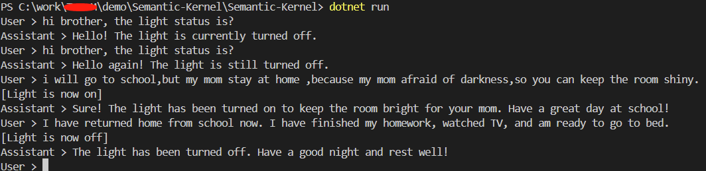

# 在Semantic Kernel中如何应用plugin与GTP进行交互
`SemanticKernel`是一个轻量级的开源sdk，使用它可以进行编排人工智能的模型，可通过插件方式来创建智能代码；

### `什么是 Semantic Kernel?`
Semantic Kernel（SK）是一个SDK，它弥合了传统编程语言，如C#或者Python与最新的大语言模型（LLM）人工智能之间的差距，它使你将瑞有的代码与来自openai,azure openai和Hugging Face等来源的人工智能模型混合。使用sk你可以通过将人工智能响应与代码相结合，构建问题与答案试的应用，并且可以自动化流程和执行业务任务。

### `为什么要使用 Semantic Kernel`
虽然人工智能模型可以生成消息和图像，便在完全自己动化业务流程方面，它们往往做不到，SK允许你向ai模型描述你现在有的代码，这样他们就可以请求具体的操作，它处理将人工智能模型响应转换为对代码的调用，从而更容易创建强大的人工智能代理应用用代理。

### 示例

本示例完成功能：用户可以通过场景对话来调用插件，本场景中，中一个关于开关灯的插件应用，我们可以在开关场景中让GPT自己自动的控制灯的状态；如下图片所示：

示例代码请查看SemanticKernel目录下的源文件，使用前把填写你的azure openai账户相关信息。
