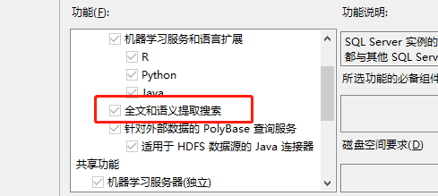

#### 利用中文分词组件与SqlServer的full-text index特性进行数据库列全文搜索
&#8195;&#8195;我们在经常在一些业务场景中会出现，用户通过输入一串关键字，然后搜索出指定数据范围内包含一个或者多个关键的数据。
&#8195;&#8195;我们常规做法中，我们通过数据库查询语言SQL中的关键字like可以满足，但是如果在一个数据中，需要找到几个特殊词语组合情况，那么这个时候就可能要进行多次搜索，然后在把结果汇总组合，找到符合条件的数据，然后输出。  
&#8195;&#8195;在以上复杂的情况，我们还可以使用数据库的full-text index特性，对某指定数据列进行处理，然后通过SQL全文索引关键进行查询满足符合我们条件。
>注意：如果使用SQLServer的全文化索引，首先先确定你当前的数据库环境是否支持此功能，查询语句是：`SELECT FULLTEXTSERVICEPROPERTY('IsFullTextInstalled')`，如果返回值是1，那么表示此系统支持。我目前使用的是sqlserver 2019 express，只要安装了full-text index功能即可使用。

Sqlserver Express　2019的full-text index功能安装选项：
 
 
##### 一、创建和删除全文索引
##### 二、使用全文索引查询数据
##### 1.查询含有所有关键词的语句（必需包含所有关键词）
##### 2.查询含有任意一个关键词的语句（只要含有一个关键词就行了）
##### 3.查询有不同匹配精确度的多个字段
##### 三、创建测试数据库与数据库表 
