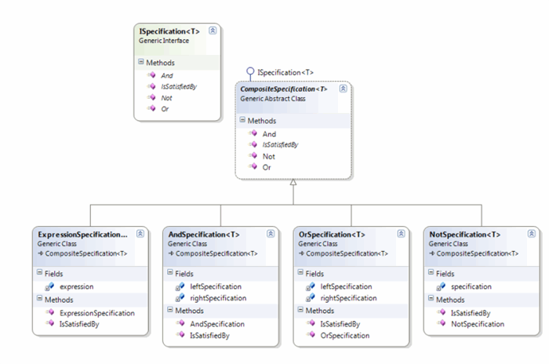

### C＃中的规范模式
> 本文介绍了如何使用规范模式在C＃中编写Linq查询。
#### 简介

&#8195;&#8195;在本文中，我们将探索经典的规范模式并实现它，以组成LINQ查询以及非LINQ查询。本文还将帮助初学者了解规范模式以及如何在实践中实现它。规范模式的主要好处包括可重用性，可维护性，业务规则与业务对象之间的松散耦合，可读性和易于测试。
#### 规范模式

&#8195;&#8195;根据Wikipedia的定义，规范模式是一种特殊的软件设计模式，通过使用布尔逻辑将业务规则链接在一起，可以重新组合业务规则。简而言之，业务规则是根据单一职责原则（SRP）进行隔离的，并使用布尔操作数（AND，OR或NOT）进行链接或组合，以实现所需的结果。每个单独的业务规则称为规范。

&#8195;&#8195;在本文示例中，每个规范都继承了抽象的CompositeSpecification类，该类定义了一个称为IsSatisfiedBy的抽象方法。此方法是规范模式的引擎。此方法的责任是将业务规则（规范）应用于所讨论的对象，并返回布尔结果。规范模式的主要目标是选择满足一组链接在一起的规范的对象子集。
<center> <!--开始居中对齐-->

</center> <!--结束居中对齐-->
### 接口ISpecification &#60;T&#62;
&#8195;&#8195;接口ISpecificaton <T>是所有使用规范的定义。 每个规范都应实现四个方法IsSatisfiedby（），And（），Or（）和Not（）。 如前所述，IsSatisfiedBy方法具有将业务规则应用于对象的主要功能。 And，Or和Not布尔运算符方法有助于将规范链接在一起，以创建复合业务规则。 规范模式不限于这三个布尔运算符（即），也可以根据需要提供类似AndOr，AndNot等的方法（但是链接And和Or给出AndOr，因此拥有此类方法仅出于方便目的）。 此外，如果您能提出自己的想法，则可以解除自己的想象力，并定义自己的连锁方法。
```c#
public interface ISpecification<T>    {
    bool IsSatisfiedBy(T o);
    ISpecification<T> And(ISpecification<T> specification);
    ISpecification<T> Or(ISpecification<T> specification);
    ISpecification<T> Not(ISpecification<T> specification);
}
```
### CompositeSpecification 类
&#8195;&#8195;在所有规范中，And，OR和Not方法的实现都是相同的，只是IsSatisfiedBy根据业务规则而有所不同。 因此，我们定义了一个称为CompositeSpecification的抽象类，该类实现And（），Or（）和Not（）方法，并将IsSatisfiedBy方法留给其子类来实现，方法是将该方法声明为抽象。

接口和抽象类的实际代码如下所示：
```c#
public abstract class CompositeSpecification<T> : ISpecification<T>     
{
    public abstract bool IsSatisfiedBy(T o);

    public ISpecification<T> And(ISpecification<T> specification)       
    {
        return new AndSpecification<T>(this, specification);
    }
    public ISpecification<T> Or(ISpecification<T> specification)        
    {
        return new OrSpecification<T>(this, specification);
    }
    public ISpecification<T> Not(ISpecification<T> specification)       
    {
        return new NotSpecification<T>(specification);
    }
}
```
And，Or和Not方法仅分别创建和返回AndSpecification，OrSpecification和NotSpecification对象。如后面各节中所讨论的，现在不必担心这些类。如果仔细研究，您会发现AndSpecification和OrSpecification类接受两个ISpecification参数，与Not不同，Not对一个参数感到满意，考虑到前者是二进制运算符，而后者是一元运算符。为了说明这一点，请考虑一种情况，我们需要过滤出三星品牌和智能手机类型的手机。我们为品牌（带Samsung的）和类型（带Smart的）分别定义两个规格。生成的电话对象应同时满足这两个规范。为了实现这一目标，我们使用And方法链接品牌和类型规范。同样，要选择三星品牌或智能类型的手机，我们将两种规格都与Or方法链接在一起。在这两种情况下，我们都使用两个规范。但是，要选择除三星以外的所有其他品牌，我们可以使用一个规格（品牌），Not方法就是这种情况。不是所有以上情况都可以用And和Or方法的该关键字替换第一个参数。  
下面的示例更好地说明了这一点：
```c#
ISpecification SamsungSmartSpec = samsungBrandSpec.And(smartTypeSpec);
```
And方法本身是从另一个规范中调用的，因此我们可以利用它，并将调用规范用作创建AndSpecification的参数之一, 这样的话，它的可读性也更高,例如：  
```c#
ISpecification SamsungSmartSpec = dummySpecification.And(samsungBrandSpec, smartTypeSpec);
```
### 规范模式如何连接使用
&#8195;&#8195;规范模拟的目的在于如何将这些条件链接连接起来使用，这些类本身不封装任何业务规则，但可以帮助将那些业务规则链接在一起。 这些类之一的定义“ And”布尔运算符的代码如下所示：
```c#
public class AndSpecification<T> : CompositeSpecification<T>    
{
    ISpecification<T> leftSpecification;
    ISpecification<T> rightSpecification;

    public AndSpecification(ISpecification<T> left, ISpecification<T> right)  {
        this.leftSpecification = left;
        this.rightSpecification = right;
    }

    public override bool IsSatisfiedBy(T o)   {
        return this.leftSpecification.IsSatisfiedBy(o) 
            && this.rightSpecification.IsSatisfiedBy(o);
    }
}
```
如您所见，IsSatisfiedBy方法在其他规范（带有业务规则）上调用其对应对象，并将结果与布尔AND（&&）合并。 左边和右边的规范（布尔AND的操作数）是在对象实例化期间（参见构造函数）由上一节中讨论的CompositeSpecification类分配的。 和和非规范类也以类似的方式实现。 由于篇幅所限，此处未提供这些类的代码，但完整的源代码附在本文结尾处，供您下载。

#### C#中表达式模式
&#8195;&#8195;上面已经展示了如何实现和使用规范模式，我们已经看到了规范的定义以及如何将它们链接在一起。 但是，包含业务规则的实际规范又如何呢？ 

当我们专注于基于LINQ的表达式时，仅定义一个包含LINQ表达式的规范就足够了。 带有条件的LINQ查询可以在对象上进行检查并返回布尔结果，可以表示为Func <T，bool>类型。 因此，我们的规范类接受这种类型的参数。 IsSatisfiedBy方法在作为参数接收的对象上执行此LINQ表达式，并返回正确或错误的结果。 *除非没有链接，否则链接规范类（（AndSpecification，OrSpecification或NotSpecification）将调用此方法*。
```C#
public class ExpressionSpecification<T> : CompositeSpecification<T>   {
    private Func<T, bool> expression;
    public ExpressionSpecification(Func<T, bool> expression)    {
        if (expression == null)
            throw new ArgumentNullException();
        else
            this.expression = expression;
    }

    public override bool IsSatisfiedBy(T o)   {
        return this.expression(o);
    }
}
```
#### 实际用法
&#8195;&#8195;最后，让我们通过一个简单的示例查看实际用法。 在我们的示例中，我创建了一个移动电话对象列表，每个对象都有特定的品牌和类型（这些类的源代码可以在本文结尾处的文件中找到）。 我们创建规格以根据类型或品牌选择特定类型的电话模式。 我们还通过链接简单的规范来创建复杂/复合的规范。
```c#
class Program
{
    static void Main(string[] args)
    {
        List<Mobile> mobiles = new List<Mobile> { 
            new Mobile(BrandName.Samsung, Type.Smart, 700), 
            new Mobile(BrandName.Apple, Type.Smart), 
            new Mobile(BrandName.Htc, Type.Basic), 
            new Mobile(BrandName.Samsung, Type.Basic) };

        ISpecification<Mobile> samsungExpSpec =
           new ExpressionSpecification<Mobile>(o => o.BrandName == BrandName.Samsung);
        ISpecification<Mobile> htcExpSpec =
           new ExpressionSpecification<Mobile>(o => o.BrandName == BrandName.Htc);
        ISpecification<Mobile> SamsungHtcExpSpec =  samsungExpSpec.Or(htcExpSpec);        
        ISpecification<Mobile> NoSamsungExpSpec = 
          new ExpressionSpecification<Mobile>(o => o.BrandName != BrandName.Samsung);

        var samsungMobiles = mobiles.FindAll(o => samsungExpSpec.IsStatisfiedBy(o));
        var htcMobiles = mobiles.FindAll(o => htcExpSpec.IsStatisfiedBy(o));
        var samsungHtcMobiles = mobiles.FindAll(o => SamsungHtcExpSpec.IsStatisfiedBy(o));
        var noSamsungMobiles = mobiles.FindAll(o => NoSamsungExpSpec.IsStatisfiedBy(o));
    }
}
```
在这里，我们定义了四个不同的规范，如下所示：  
1.唯一品牌三星  
2.唯一品牌HTC  
3.三星或HTC品牌  
4.除了品牌三星  
&#8195;&#8195;前两个规范很简单； 使用LINQ条件创建一个简单的表达式规范。 对于第三条规则，通过使用And方法链接为1和2定义的规范来创建复合规范。 第四个规范使用Not也很简单。同样，我们可以通过链接简单的或另一个复杂的规范来定义更复杂的规范。 例如，要查找三星或HTC品牌的手机，但仅智能类型的手机，查询可以组成如下：
```c#
ISpecification<Mobile> complexSpec = (samsungExpSpec.Or(htcExpSpec)).And(brandExpSpec);
```
#### 非LINQ表达式
&#8195;&#8195;在某些情况下，我们可能需要在不使用LINQ表达式的情况下定义业务规则。 在这种情况下，expressionSpecification类将替换为与所讨论的业务规则数量相等的简单但不同的Specification类的数量。 在上面的示例中，要找出三星或HTC品牌的手机，我们需要两种不同的规格类别，一种用于三星品牌检查，另一种用于HTC品牌检查。 还应注意，这些规范是特定于类型的，换句话说，与对象模型紧密耦合。 例如，要检查手机的品牌是否为三星，规范类需要事先知道对象的类型。 下面显示了一个非LINQ规范示例，用于基于预定义的成本来评估手机是否为特级手机：
```c#
public class PremiumSpecification<T> : CompositeSpecification<T>
{
    private int cost;
    public PremiumSpecification(int cost) {
        this.cost = cost;
    }
 
    public override bool IsSatisfiedBy(T o) {
        return (o as Mobile).Cost >= this.cost;
    }
}
```
如您所见，IsSatisfiedBy方法需要事先知道对象的类型（在这种情况下，对象类型为Mobile）才能访问其Cost属性。
#### 混和使用😁
&#8195;&#8195;在极少数情况下，我们可能需要在业务逻辑中混合使用LINQ和非LINQ表达式。 由于链接规范类（And，Or和Not规范）与业务规则规范类（expressionSpecification和non-LINQ规范）分开，因此我们可以将非LINQ与LINQ表达式类型规范链接在一起。 在上一节中，我们定义了非LINQ规范。 现在，我们可以将它与LINQ表达式链接起来，如下所示：
```c#
ISpecification<Mobile> premiumSpecification = new PremiumSpecification<Mobile>(600);
ISpecification<Mobile> linqNonLinqExpSpec = NoSamsungExpSpec.And(premiumSpecification);
```
这将获取所有非三星品牌的手机，但只会获取高级手机。 在我们班上，结果是苹果。
### 一个简单的用例
我写了一篇文章，介绍如何将这种模式与责任链（cor）模式一起使用，或者用更好的语言来形容，如何使用规范模式使cor更易于使用和重用。 点击这里阅读。

<!--本文翻译至：https://www.codeproject.com/articles/670115/specification-pattern-in-csharp-->


