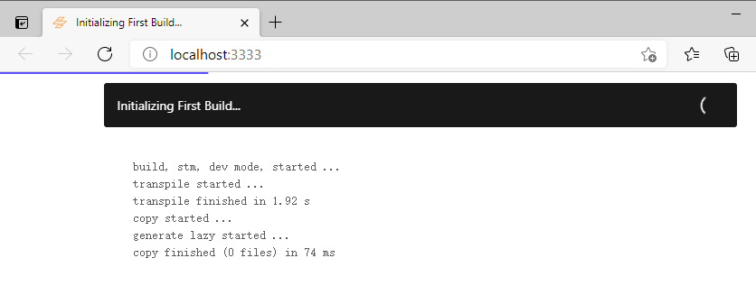
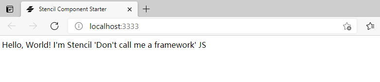

#### 开始一个新项目
Stencil 依赖最新版本的NodeJs，开始之前，请确认你在开发机上已经安装或者更新Nodejs到最新版本。  
>mpm需要6以上的版本.
```shell
 npm init stencil
 ```
 使用Stencli能够创建独立组件或者独立应用。你使用init命令时会弹出选择对应的类型，初使化相关项目名称后，你就可以开始你的项目或应用了。
 执行init命令后，输出窗口内容如下，然后你就可以进行选择相应的内容：
 ```shell

? Pick a starter » - Use arrow-keys. Return to submit.

>  ionic-pwa     Everything you need to build fast, production ready PWAs
   app           Minimal starter for building a Stencil app or website   
   component     Collection of web components that can be used anywhere  
 ```
上面选择component，输入名称后显示以下内容，说明已经执行成功：
```shell
√ Pick a starter » component
√ Project name » stm

✔ All setup 🎉 in 305 ms

  > npm start
    Starts the development server.

  > npm run build
    Builds your components/app in production mode.

  > npm test
    Starts the test runner.


  We suggest that you begin by typing:

   > cd stm
   > npm install
   > npm start

  Further reading:

   - https://github.com/ionic-team/stencil-component-starter

  Happy coding! 🎈
```
#### 更新 Stencil
如果要更新stencli到最新版本，请执行以下命令
```shell
npm install @stencil/core@latest --save-exact
```

#### 运行示例
执行相应命令：
```shell
cd stm
```
会出现以下内容：
```shell
PS E:\my\web2\stm> npm run build

> stm@0.0.1 build
> stencil build --docs

[39:46.6]  @stencil/core
[39:47.0]  v2.5.2
[39:49.1]  build, stm, prod mode, started ...
[39:49.1]  transpile started ...
[39:50.6]  transpile finished in 1.44 s
[39:50.6]  copy started ...
[39:50.6]  generate custom elements bundle started ...
[39:50.6]  generate lazy started ...
[39:50.9]  copy finished (0 files) in 329 ms
[39:51.4]  generate custom elements bundle finished in 862 ms
[39:52.0]  generate lazy finished in 1.44 s
[39:52.2]  build finished in 3.03 s
```
运行刚才编译的项目
```shell
PS E:\my\web2\stm> npm start

> stm@0.0.1 start
> stencil build --dev --watch --serve

[41:39.0]  @stencil/core
[41:39.3]  v2.5.2
[41:42.9]  build, stm, dev mode, started ...
[41:43.0]  transpile started ...
[41:45.1]  transpile finished in 2.19 s
[41:45.1]  copy started ...
[41:45.2]  generate lazy started ...
[41:45.2]  copy finished (0 files) in 77 ms
[41:46.0]  generate lazy finished in 851 ms
[41:46.2]  build finished, watching for changes... in 3.25 s

[41:46.2]  http://localhost:3333/

```
然后浏览器会默认显示，显示结果：  
  
